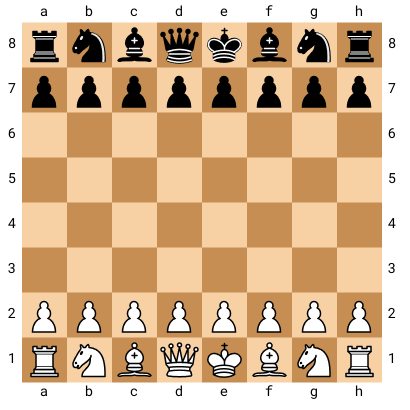

# RainForceMate
A simplified version of chess game via RL algorithm

## Introduction
Two environments are available in this project:
- **Shortest Path**: is a deterministic game whose aim is to find the shortest path between two cells according to the piece (agent) using both simple RL (Policy Evaluation/Improvement/Iteration) algorithms and model-free techniques (MonteCarlo, TD learning, SARSA, Q -learning for example).
- **Capture pieces**: the goal is to capture as many of the opponent's pieces in as many moves using Q-learning, Policy Gradient or REINFORCE techniques. In this case the agent would be the player (no longer the piece) who, once run, can capture pieces against an opponent. Since chess has a space complexity of $10^{46}$ we would also like to be able to implement a NN to do Q-network learning.

## Requirements

Remember to install Python-Chess library:

```bash
conda install -c conda-forge python-chess
```

## Capture pieces

It's a simplified version of chess. 

In this environment the agent (playing white) is rewarded for capturing pieces (not for checkmate). 

After running this notebook, you end up with an agent that can capture pieces against a random oponnent.

Here Q-networks algorithm (as an alternative to Q-tables in **Shortest Path**) is used since chess has state space complexity of $10^46$ (too much information to put in a Q-table).

## Python-Chess library
You can create a chess board object using the chess.Board() class:
    
```python
import chess
board = chess.Board()
```

You can call .board() to get a visual representation of the board:

```python
board.board()
```
The output is the following:



You can print the current board using the print() function:

```python   
print(board)
```

You can make a move using the .push_san() method using algebraic notation:

```python
board.push_san("e4") # e2 to e4
```

Or using UCI notation:
    
```python   
board.push_uci("g1f3") # g1 to f3
```

Or others operations like:
    
```python
# Check if the game is over
if board.is_game_over():
    print("Game over!")

# Get a list of legal moves
legal_moves = list(board.legal_moves)

# Check the current side to move
if board.turn == chess.WHITE:
    print("White to move")
else:
    print("Black to move")
```
